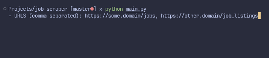
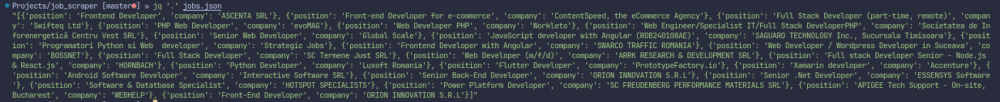

## About

This is a simple script that looks through a list of URLs and scrapes the data.

## Usage

Put each URL on a new line inside `urls.txt`. If the file is not found or there are no URLs inside, they must be entered through a prompt, separated by commas.

A `jobs.json` file will be generated containing the scraped data in JSON format.
You can use [jq](https://github.com/jqlang/jq) to view the data.

